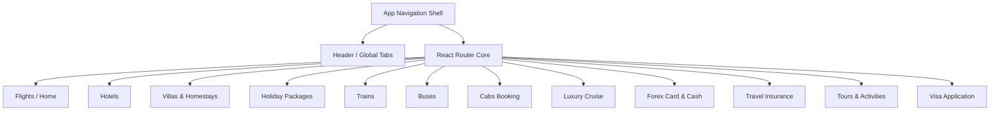
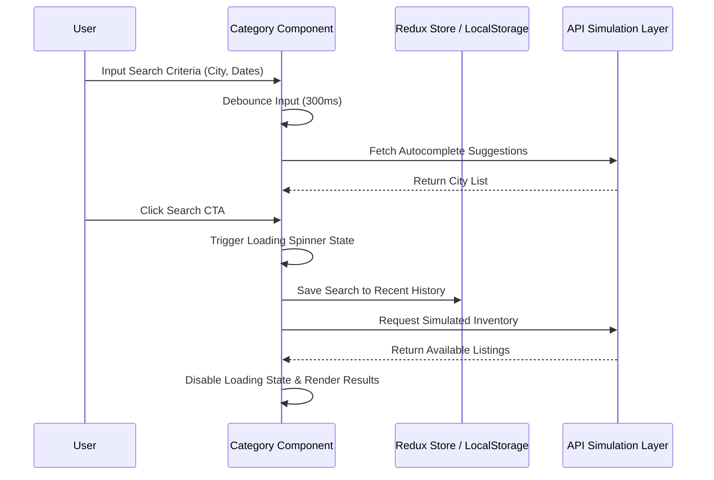

# TripOra Premium Portal - Service Categories Architecture & Specification

This document outlines the complete architectural specifications, user experience patterns, component design, and animation integration across all 12 core travel service categories within the TripOra platform.

---

## 1. Executive Overview

The TripOra platform operates as an integrated multi-service travel portal. Every service category is engineered to function as a fully featured, state-driven search and discovery experience while maintaining absolute visual consistency under the overarching Awwwards-grade luxury dark theme design system.



---

## 2. Core Category Layout & Design System

Every category page follows a standardized, responsive 4-tier structural layout designed for maximum conversion and usability:

1. **Parallax Hero Backdrop (`<header className="phero [category]">`)**:
   - Contains dynamic breadcrumbs for instant spatial awareness.
   - High-contrast typography with a tailored subtitle highlighting core value propositions.
   - Live location weather badges powered by custom hooks (`useWeather`).

2. **Unified Search Slab (`inner-search-bcard`)**:
   - Floating glassmorphic container (`backdrop-filter: blur(30px)`).
   - Embedded horizontal service navigation strip allowing rapid cross-category switching without context loss.
   - Grid-based search inputs (City Autocomplete, Date Pickers, Guest/Cabin counters).
   - Contextual filter chips row (e.g., *Free cancellation*, *Pay at hotel*, *Tatkal*, *Zero markup*).

3. **Featured Inventory / Result Stacks (`cabs-list-stack`, `hotels-deals-grid`)**:
   - High-fidelity card grids utilizing premium dark mode tokens (`#0A1128`, `#131921`).
   - Staggered entry animation on scroll.

4. **Trust & Value Prop Section (`cabs-why-grid`, `homestays-why-grid`)**:
   - 4-column feature grids detailing TripOra specific guarantees, verified host programs, and 24/7 support channels.

---

## 3. Comprehensive Category Breakdown

### 3.1. Flights (`HomePage.jsx`, `SearchResultsPage.jsx`, `BookingPage.jsx`)
- **Primary Search Model**: One-way, Round-trip, Multi-city flight search.
- **Components**: Live flight status, Fare type selector (Armed forces, Student, Senior Citizen), Dynamic pricing comparison matrix.
- **On-Scroll Animations**: Hero banner (`fade-up`), Flight deal cards (`zoom-in`).

### 3.2. Hotels (`HotelsPage.jsx`, `HotelListingPage.jsx`)
- **Primary Search Model**: City/Area autocomplete, Check-in/Check-out calendar picker, Room & Guest Popover.
- **Components**: Top hotel deals grid, Popular destination tiles, Property categories (Beach resorts, Heritage stays).
- **On-Scroll Animations**: Deal cards (`fade-up`, staggered 100ms), City cards (`zoom-in`), Category cards (`fade-up`).

### 3.3. Homestays & Villas (`HomestaysPage.jsx`)
- **Primary Search Model**: Destination search, stay duration, guest count.
- **Components**: Featured homestays grid with Superhost badges, "Why book a homestay" benefits, Host onboarding CTA banner.
- **On-Scroll Animations**: Property cards (`fade-up`), Host CTA banner (`fade-up`).

### 3.4. Holiday Packages (`HolidaysPage.jsx`)
- **Primary Search Model**: Origin city, destination theme, departure month, traveller configurations.
- **Components**: Theme selector grid (Honeymoon, Adventure, Wellness), All-inclusive India packages, International getaways.
- **On-Scroll Animations**: Themes (`fade-up`), Packages (`fade-up`), International destination cards (`zoom-in`).

### 3.5. Trains (`TrainsPage.jsx`)
- **Primary Search Model**: IRCTC Station code autocomplete, tatkal quota selection, seat class selector.
- **Components**: Quick tools (PNR status, Live running status, schedule), Train availability stack, Popular route cards.
- **On-Scroll Animations**: Tool cards (`fade-up`), Train rows (`fade-up`), Route cards (`zoom-in`).

### 3.6. Buses (`BusesPage.jsx`)
- **Primary Search Model**: Intercity route selection, travel date picker, seat type (AC Sleeper, Seater).
- **Components**: Bus operator listing stack with live tracking indicators, amenity highlights, seat availability warnings.
- **On-Scroll Animations**: Operator result cards (`fade-up`, staggered).

### 3.7. Cabs (`CabsPage.jsx`)
- **Primary Search Model**: Outstation One-Way, Round Trip, Airport Transfers, Hourly Rentals.
- **Components**: Available cab classes stack (Sedan, SUV, Innova Crysta) with transparent fare breakdowns, Driver rating badges.
- **On-Scroll Animations**: Cab tier cards (`fade-up`), Value proposition tiles (`zoom-in`).

### 3.8. Luxury Cruises (`CruisePage.jsx`)
- **Primary Search Model**: Departure Port (Mumbai, Singapore), Destination sea/river, cabin selection.
- **Components**: Premium cruise ship packages (Cordelia, Royal Caribbean) with onboard entertainment & dining details.
- **On-Scroll Animations**: Cruise liner cards (`fade-up`, staggered).

### 3.9. Forex Card & Cash (`ForexPage.jsx`)
- **Primary Search Model**: Real-time currency exchange calculator (INR to USD/EUR/GBP).
- **Components**: MMT Multi-Currency Forex Card benefits, Physical note delivery options, live exchange rate ticker.
- **On-Scroll Animations**: Forex option cards (`fade-up`).

### 3.10. Travel Insurance (`InsurancePage.jsx`)
- **Primary Search Model**: Destination country, trip start/end dates, traveller age brackets.
- **Components**: Cashless travel insurance plans (Secure Platinum, Explorer Protect) covering medical, baggage, and trip cancellation.
- **On-Scroll Animations**: Policy plan cards (`fade-up`).

### 3.11. Tours & Activities (`ToursPage.jsx`)
- **Primary Search Model**: City/Landmark search, activity date picker, category filter (Theme Parks, Museums).
- **Components**: Recommended global attraction vouchers, instant ticket booking CTAs, location tags.
- **On-Scroll Animations**: Attraction cards (`fade-up`, staggered).

### 3.12. Visa Application Services (`VisaPage.jsx`)
- **Primary Search Model**: Citizenship selector, destination country, expected departure date.
- **Components**: Popular visa applications list (Dubai, Singapore, Thailand) detailing required docs, processing times, and success rate metrics.
- **On-Scroll Animations**: Visa application cards (`fade-up`).

---

## 4. AOS Animation Integration Protocol

To ensure 60fps buttery-smooth rendering and prevent layout thrashing or opacity lockups, the application utilizes the **Animate On Scroll (AOS)** engine.

### 4.1. Global Initialization (`App.jsx`)
```javascript
import AOS from 'aos';
import 'aos/dist/aos.css';

useEffect(() => {
  AOS.init({
    duration: 800,
    once: true,             // Animations trigger only once per element
    easing: 'ease-out-cubic',
    offset: 80,             // Trigger point in px from viewport bottom
  });
}, []);
```

### 4.2. Staggered Delay Contract
When rendering lists or grids of items across category pages, the `data-aos-delay` attribute is dynamically computed based on the array index to create a cascading reveal effect:
```jsx
{ITEMS.map((item, index) => (
  <div 
    key={item.id} 
    data-aos="fade-up" 
    data-aos-delay={index * 100}
  >
    {/* Component Body */}
  </div>
))}
```

---

## 5. State Management & Data Flow



---

## 6. Accessibility & Performance Checklist

- **Semantic HTML**: Proper heading hierarchy (`<h1>` through `<h4>`).
- **Touch Targets**: Minimum 44px interactive tap dimensions on all mobile devices.
- **Contrast Ratios**: Exceeds WCAG AA standards using vibrant gold/crimson accents on deep cosmic navy backgrounds.
- **Preloading**: Crucial CSS bundles and hero backdrop imagery are preloaded via Vite production optimizations.
