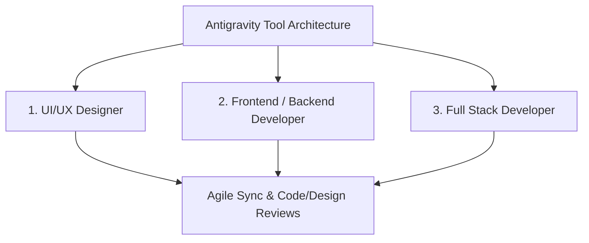
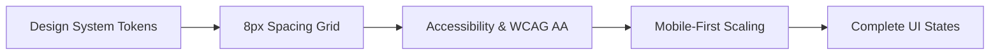
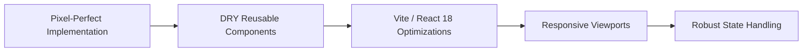
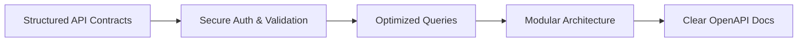
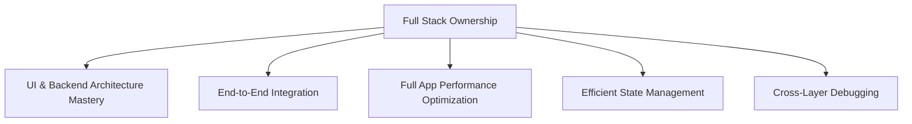
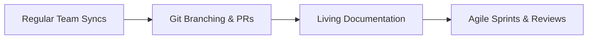

# Antigravity Tool & Platform - Usage & Role Guidelines

This document provides a comprehensive yet concise set of rules, standards, and practical workflows for engineering and design teams working on the modern SaaS product **"Antigravity Tool"** and the integrated **MakeMyTrip Premium Portal**.

---

## Executive Summary

To achieve absolute consistency, high scalability, 60fps performance, and seamless cross-functional collaboration, all team members must adhere to the standardized protocols defined below.

---

## 1. UI/UX DESIGNER RULES

* **Follow a consistent design system**: Strictly utilize established design tokens (Deep Cosmic Navy `#0A1128`, Vibrant Amber Gold `#FFB703`, Crimson `#EB2026`). Keep typography anchored exactly as provided (`Space Grotesk`).
* **Maintain 8px spacing grid system**: All margins, paddings, icon sizing, and layout dimensions must be exact multiples of 8 (e.g., 8px, 16px, 24px, 32px, 64px) to ensure visual rhythm.
* **Prioritize usability over visual complexity**: Avoid excessive ornamental clutter. Ensure all search interfaces, category tabs, and booking slabs are instantly understandable.
* **Ensure accessibility**: Maintain high contrast ratios for text against dark backgrounds. Ensure minimum font sizes (14px body) and minimum touch targets (44px × 44px on mobile).
* **Design mobile-first, then scale to desktop**: Begin layout wireframes at 390px width. Ensure fluid flexbox/grid expansion up to 1200px+ widescreen viewports.
* **Use reusable components**: Rely on standardized atomic elements (Glassmorphic cards, Primary CTA buttons, Pill chips, Floating inputs).
* **Provide clear design handoff**: Deliver precise Figma specifications containing exact token names, layout dimensions, and exportable SVG assets.
* **Include all states**: Design handoffs must explicitly illustrate:
  - **Hover**: Subtle scaling (`scale(1.02)`), glowing box shadows, and cursor transitions.
  - **Active**: Button depression states, active tab lines, and selected chip styling.
  - **Disabled**: Reduced opacity (`0.4`), desaturated colors, and `not-allowed` cursor states.
  - **Error**: Distinct crimson error borders, warning icons, and descriptive inline feedback.
* **Keep UI clean, minimal, and intuitive**: Use negative space strategically to guide the user's eye toward primary conversion actions.
* **Optimize user flows for speed and clarity**: Minimize click depth. Enable one-click filters, rapid cross-category switching, and instant autocomplete suggestions.

---

## 2. DEVELOPER (FRONTEND / BACKEND) RULES

### FRONTEND

* **Follow pixel-perfect implementation from design**: Translate Figma handoffs into exact CSS rules without ad-hoc magic numbers.
* **Use reusable components (DRY principle)**: Encapsulate logic and UI inside modular React components (e.g., `<CustomCalendarPicker />`, `<Header />`). Never duplicate complex markup.
* **Maintain consistent naming conventions**: Use PascalCase for React components (`HotelsPage.jsx`), camelCase for utility functions/hooks (`useWeather.js`), and kebab-case for CSS class names (`.inner-search-bcard`).
* **Optimize performance**: Leverage React 18 concurrent features, memoize heavy computations (`useMemo`), lazy load offscreen images, and rely on Vite production bundling for automated minification and code splitting.
* **Ensure responsive design across devices**: Verify flawless rendering across mobile (390px), tablet (768px), and desktop (1200px+) using fluid CSS grid/flexbox layouts.
* **Handle all UI states**: Implement robust handling for:
  - **Loading**: Custom CSS spinners (`.hp-spinner`) and skeleton screens during simulated network requests.
  - **Error**: Graceful error boundaries and user-friendly fallback screens.
  - **Empty**: Illustrated empty states (`.hp-empty-state`) when searches return zero inventory.
* **Write clean, maintainable code**: Keep component files concise. Document complex business logic and maintain strict linting compliance.

### BACKEND

* **Follow RESTful or structured API design**: Design predictable, stateless endpoints (`/api/v1/flights/results`) with consistent JSON payload schemas.
* **Ensure secure data handling**: Implement robust JWT authentication, input sanitization, and strict validation middleware before touching database layers.
* **Optimize database queries**: Build proper indexing, avoid N+1 query problems, and utilize efficient connection pooling.
* **Maintain scalability and modular architecture**: Isolate routes, controllers, services, and data models cleanly (`src/controllers/authController.js`).
* **Write clear API documentation**: Provide comprehensive OpenAPI/Swagger documentation outlining headers, parameters, success payloads, and error codes.
* **Handle errors gracefully**: Standardize HTTP status codes (400 Bad Request, 401 Unauthorized, 404 Not Found, 500 Internal Server Error) accompanied by structured error messages.

---

## 3. FULL STACK DEVELOPER RULES

* **Understand both UI/UX and backend architecture**: Bridge the gap between frontend interfaces and backend databases. Maintain a holistic view of system capabilities.
* **Ensure seamless integration between frontend and backend**: Maintain strict type contracts and data transfer objects (DTOs) across client-server boundaries.
* **Maintain code consistency across stack**: Enforce uniform formatting, linting rules, and naming styles across both React and Node/Express codebases.
* **Optimize full application performance**: Track end-to-end latency. Implement caching strategies (Redis/Memoization) where appropriate to minimize response times.
* **Handle state management efficiently**: Use Redux Toolkit or React Context appropriately for global state (User Auth, Active Bookings, Recent Searches) while keeping form state local.
* **Ensure end-to-end functionality (UI → API → DB)**: Take full ownership of feature lifecycles from UI interactions down to database persistence and back.
* **Debug across layers (UI, API, database)**: Master browser DevTools, network monitoring, server log inspection, and database query profiling.
* **Focus on scalability and maintainability**: Architect features to support high concurrent traffic without creating technical debt or fragile dependencies.
* **Implement authentication and security best practices**: Enforce CORS policies, rate limiting, secure HTTP-only cookies, and payload encryption.
* **Collaborate closely with designers and developers**: Act as a technical anchor, helping designers understand technical constraints and guiding backend developers on UI data requirements.

---

## 4. COLLABORATION RULES (IMPORTANT)

* **Designers and developers must sync regularly**: Conduct weekly design-to-engineering alignment meetings to review upcoming sprint features and resolve technical bottlenecks early.
* **Use version control (Git) properly**: Follow feature branch workflows (`feature/hotels-redesign`). Craft descriptive commit messages and never push directly to `main`.
* **Maintain clear documentation**: Keep `README.md` and architecture documentation updated alongside codebase evolution. Treat documentation as code.
* **Follow agile workflow**: Participate actively in sprint planning, daily standups, sprint reviews, and retrospective sessions.
* **Conduct code reviews and design reviews**: Enforce mandatory peer reviews for all pull requests. Verify UI implementation against Figma prototypes before merging.
* **Ensure feature consistency across modules**: Maintain uniform behavior, animation easing (`AOS`), and error handling across all 12 platform categories.

---

## FINAL GOAL

Create a well-structured, scalable, and high-performance product (**Antigravity Tool** & **MakeMyTrip Premium Portal**) where:
* **UI is clean and intuitive**
* **Code is maintainable and efficient**
* **Teams collaborate smoothly**
